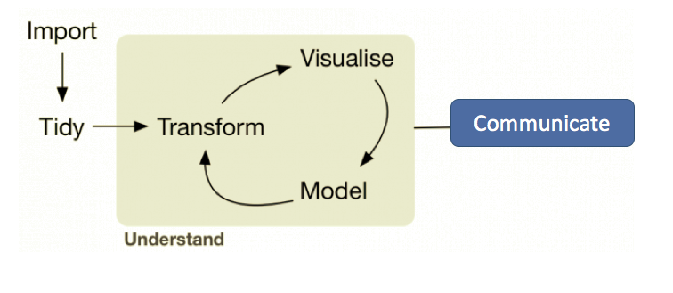

# About Me

.pull-left[

### Hi, I'm Alexa! 

I am a data scientist at Fannie Mae, where I prepare data, conduct analyses, and create reports and apps to help our customers understand their data.


]

.pull-right[


```{r, echo=F, out.width=250, out.height=250}

```

]

--

### Where can you find me?

* email: alexadibenedetto92@gmail.com
* github: https://github.com/alexadibenedetto
* linkedin: https://www.linkedin.com/in/alexadibenedetto/


```{r setup, include=FALSE}
options(htmltools.dir.version = FALSE)
library(tidyverse)
library(stargazer)
```


---
# Outline
<br>
* Why make slides in R?
* What is xaringan
  * How to install and get started
* Demo
* Customization
* Questions


---
# Why make slides in R?

.center[
```{r, echo=F, out.width=550, out.height=300}

```
]

We've widely embraced tools for importing, tidying, and understanding data programmatically.

We've started to communicate results using R Markdown documents and Shiny apps or dashboards.

...However, our business partners often expect results to be presented in a standard "slide deck" format.


---
# Why make slides in R?

Wouldn't it be easier to do all of our data import, tidying, modeling, visualization, and reporting in one place?

  * If results get updated on a schedule (monthly, quarterly), when new data gets released, powerpoint slides quickly become outdated
  * PowerPoint slides are not reproducible
  * PowerPoint slides are not easy to collaborate on or version control (think Git)
  
There are many ways to make slides in R, including [Slidy](https://bookdown.org/yihui/rmarkdown/slidy-presentation.html) and  [ioslides](https://bookdown.org/yihui/rmarkdown/ioslides-presentation.html). I like the simplicity and ease of customization that [xaringan](https://bookdown.org/yihui/rmarkdown/xaringan.html) provides.

---
class: inverse, center, middle
# {xaringan}


---
# Getting Started

The xaringan package can be downloaded like any other package in R, using the `install.packages("xaringan")` command*.

Once the package is installed, open a new xaringan template document by navigating to `File > New File > R Markdown > From Template` and choose the "Ninja Presentation" option.

This opens a xaringan template (just like an R Markdown or Shiny template). You can knit this document to see how the slides get rendered.

Full xaringan documentation can be found [here](https://slides.yihui.org/xaringan/#1) and [here](https://bookdown.org/yihui/rmarkdown/xaringan.html).

You'll see the yaml header now includes something like this:

```yaml
---
output:
  xaringan::moon_reader:
---
```

.footnote[[*] The dev version can be installed using `remotes::install_github('yihui/xaringan')`.]

---
# Selected Features

- How to make a slide (and increment)
- Font styling, bullets, content and slide classes
- Embed photos, links
- Embed R code via code chunks and inline code (and code formatting)
- Math expressions
- Overview of Customization (xaringan themes, xaringanthemer, custom css)

---
class: inverse, center, middle
# Demo


---
# Creating slides and incrementing
<br>

Slides are created using `---`.
<br>
<br>

--
You can increment content using `--`.
<br>
<br>

--
Headers are defined the same as in R Markdown, using `#`, `##`, etc.
<br>
<br>

---
# Font Styling
<br>

We can style our text like we do in R Markdown. For example, *a single asterisk italicizes text*, while **double asterisks bold text**.

* `*`, `+`, and `-` can all be used to create bullets.
  * Tabs can be used to create a nested bulleted list, and the bullet type automatically changes.
  
  
---
# Content and Slide Classes
<br>
Default **content classes** can be used to control where things appear within a slide, such as:

* `.center[]` to horizontally center whatever is inside the brackets
* `.pull-left[]` and `.pull-right[]` to create a left and right column from whatever is inside the brackets
* `.left[]` and `.right[]` to left or right align whatever is inside the brackets
<br>

Default **slide classes** can be used to control what the base slide looks like, such as:

* `class: center` horizontally centers slide content
* `class: middle` vertically centers slide content
* `class:inverse` changes the background color to the inverse of the base color (specified by the css of the theme you are using)


---
# Embedding Photos and Links

**Embedding photos** can be done a few ways. Two options are presented below:

.pull-left[
Outside of a code chunk:

``
]

.pull-right[
Inside a code chunk:

```{r, echo=T, eval=F, out.width=550, out.height=300}
knitr::include_graphics("path_to_image")
```
]


I prefer to use code chunks because it's easier to customize the display options (like size). In either case, image URLs can be used in place of file paths.
<br>
<br>

**Embedding links** looks similar:

`[link display text](url)`, for example here's a link to [google](www.google.com).

---
# Embedding R Code - Chunks

Rules of code chunks are all carried over from R Markdown.

.pull-left[For example, we can display raw data:

```{r, echo=F}
knitr::kable(head(iris[,1:3], n=5), format = 'html')
```
]

.pull-right[
Or, we can display a regression summary:

```{r, echo=F, results='asis'}
stargazer::stargazer(lm(Petal.Width ~ Sepal.Length, data = iris), type="html", style="default", keep.stat = c("adj.rsq"), font.size="tiny")
```
]

---
# Embedding R Code - Chunks

We can also display visualizations:
.center[
```{r, echo=F}
iris %>% ggplot(aes(x = Sepal.Width, y = Sepal.Length, color = Species)) +
  geom_point() +
  theme_minimal()
```
]

To display this code in our slides, we can set `echo=T` in the chunk options. If we want the code to display but not actually evaluate, we can set `echo=T, eval=F`.

---
# Embedding R Code - Inline

We can also display code inline, or display the output of R code inline. 

<br>
To **display code inline** (without evaluating it), use triple tick notation:

```r
lm(Sepal.Width ~ Sepal.Length, data = iris)
```
<br>
To **display output from code inline** (evaluating it), use single tick notation:
 
 This line was last evaluated on `r Sys.Date()`.
 
 <br>
 You can also wrap any arbitrary text in single ticks to format it to `look like code`.
 
<br>
Finally, you can highlight code either by wrapping it in double curly brackets (`{{}}`), using `*` before the line you want to highlight, or by using `#<<` after the line(s) you want to highlight.

```{r, eval=F}
lm(Sepal.Width ~ Sepal.Length, data = iris) #<<
```
---
# Math Expressions

You can write LaTeX math expressions inside a pair of dollar signs, e.g. &#36;\alpha+\beta$ renders $\alpha+\beta$. 

You can use the display style (triple ticks) with double dollar signs:

```
$$\bar{X}=\frac{1}{n}\sum_{i=1}^nX_i$$
```

$$\bar{X}=\frac{1}{n}\sum_{i=1}^nX_i$$

Caveats about LaTex can be found in the [documentation](https://slides.yihui.org/xaringan/#1).

---
class: inverse, center, middle
# Customization

---
# Overview of Customization

The quickest way to change the appearance of your slides is by using a built-in theme (see `xaringan:::list_css()` for a list of included themes). For this presentation, I used `metropolis` and `metropolis-fonts`. 

I added this line to my yaml to enable the metropolis theme:

```yaml
  xaringan::moon_reader:
    css: [default, metropolis, metropolis-fonts] #
```

* If you want to customize beyond these themes, look into the [`xaringanthemer`](https://pkg.garrickadenbuie.com/xaringanthemer/) package.

* If you are comfortable with CSS, you can create your own CSS templates. When you create a new presentation, the default CSS gets saved to the libs/remark-css folder in your working directory. Take a look there to see where you can customize/adjust the defaults. You can save your own CSS template to this folder, and reference it in your yaml header.


---
class: inverse, center, middle
# Questions?

---
# Resources I Recommend 

[Alison Hill's rstudio::conf 2019 talk](https://arm.rbind.io/slides/xaringan.html#1)

[Publishing your work](https://arm.rbind.io/prework/options/)

[Infinite Moon Reader (Instant Preview)](https://yihui.org/en/2019/02/ultimate-inf-mr/)

[Introduction to CSS](https://www.geeksforgeeks.org/css-introduction/)

